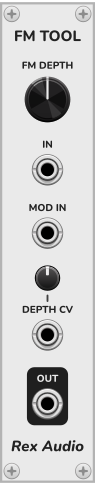
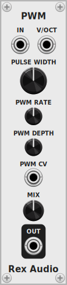

# FM Tool

## Overview
FM Tool allows you to do DX-style FM with any audio inputs. 
Connect 2 sources to the IN and MOD IN ports, turn up the FM depth, and connect the OUT port.

## FM Depth
Controls the amount of FM applied. Higher FM depth introduces more high frequency harmonics.

## IN
The carrier or main audio input. 

## MOD IN
The modulator input. The carrier will be modulated by this input at an amount set by the FM depth knob.

## Depth CV
The Depth CV in port allows you to connect modulation sources such as LFOs and ADSRs to dynamically change the FM depth.
The Depth CV knob controls the amount of this modulation of FM depth.

# Out
An audio output

## Notes
This DX-style FM is actually phase modulation (PM) using short modulated delays
but it is often called FM (frequency modulation) as it produces the same harmonics.
Using a carrier and modulator at the same frequency or harmonically-related (in-tune) frequencies produces a harmonic spectrum. 
Carriers and modulators at inharmonic (out-of-tune) frequencies relative to each other produces a dissonant spectrum.
#

# PWM

## Overview
PWM allows you to do pulse width modulation with any audio input. 

## Mode
Right-click to see the menu and choose the mode:
## Comparator mode:
The default mode. It works for all kinds of signals and is similar to analog PWM modules, but very narrow pulse widths produce distortion, the pulse width can change depending on the level of the input. The output is at full scale volume, so this mode should be used before your vca and envelopes. The V/Oct input does <u>not</u> need to be connected in this mode. 
## Delay mode:
This mode works best with sawtooth inputs, and with the V/Oct input connected, but it can also be used with just the audio input.  This mode retains more of the character of the audio input instead of creating perfect pulse waves, and it can sometimes sound similar to a chorus or flanger. 

## In
The audio input. 

## V/OCT in
Input for voltage/octave signals. This allows keytracking of the chosen pulse width so each note has the same width. This input is not needed in comparator mode but is recommended in delay mode.

## Pulse Width
Controls the pulse width. At 50% it will produce square waves with odd harmonics. Away from 50% it begins to produce even harmonics. Near 0% and 100% it produces a narrow, thin sounding pulse. 

## PWM rate
Controls the speed of the inbuilt LFO that is used to modulate the pulse width. When the PWM CV input is connected, the LFO is disabled and the rate knob is unused.

## PWM depth
Controls the amount of pulse width modulation. When no PWM CV input is connected, this controls the LFO depth. When a CV input is used, it controls the depth of the CV.

## PWM CV
Allows you to override the inbuilt LFO and use your own modulation sources for PWM

# Mix
A dry/wet control. At 100% you get full PWM.

# Out
An audio output

## Notes
The delay mode uses delays with inverted polarity to create PWM. To avoid clicks when changing notes, the plugin uses crossfaded delays when the V/oct input changes by a semitone or more, and uses delay time glide for smaller or very fast pitch changes to track legato, vibrato and fast arpeggios in the V/Oct signals. 

The comparator mode uses a level threshold and outputs a positive pulse when the input is above the threshold, and a negative pulse otherwise. This mode also uses a gate to prevent DC offset. Comparators can cause aliasing. 
To reduce the sharpness caused by these methods of PWM, the plugin also contains lowpass filters.
